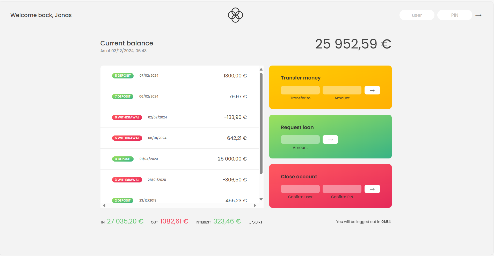

#BANKIST APP

# 🏦 Bankist App

<h3>Bankist App Preview </h3>
<br>


Bankist App is a JavaScript-based banking application that I developed as part of the Jonas Schmedtmann's JavaScript course. It allows users to manage their accounts, perform various banking operations, and experience a seamless and secure online banking experience.

## Features

- 🔐 **User Authentication**: Secure user authentication and login process.
- 📊 **Account Overview**: View account balances, transaction history, and other details.
- 💸 **Transfer Money**: Transfer funds between your own accounts and to other users.
- 💰 **Request Loan**: Request a loan from the bank based on your account history.
- 🚪 **Close Account**: Close your account and terminate your banking relationship.


## Technologies Used

- HTML
- CSS
- JavaScript

  ## 📱 App Profiles

  ```

  ```

You can access the app profiles with the following usernames and PINs:

### Jonas shmedtmann

- 👤 Username: `js`
- 🔐 PIN: `1111`

### Jessica Davis

- 👤 Username: `Jd`
- 🔐 PIN: `2222`
